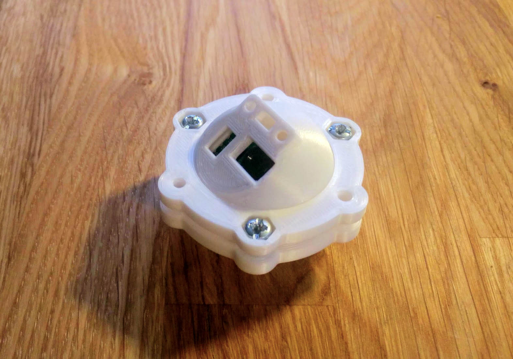
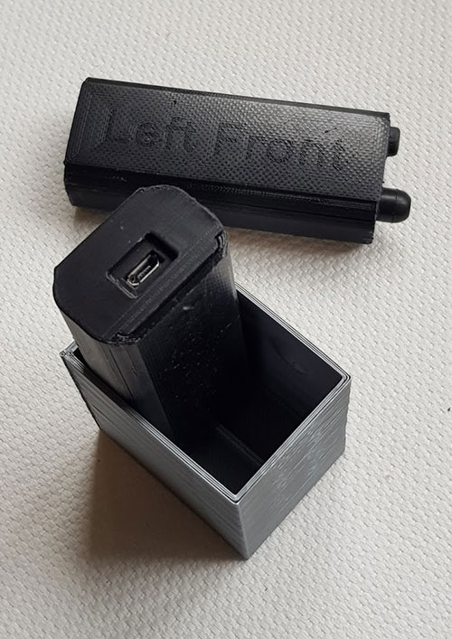

# Print you own enclosures

You can of course create your own casing. Or you can 3D print one of the versions I've put together. There are some different options, either one box for the whole kit including rechargeable battery. Or a separate smaller enclosure for the sensor components only, easier to place in the wheel well but it obviosuly necessitates a cable between the sensor and cpu/bluetooth unit.

Download STL or STEP files here if you want to 3D print or scrutinize the designs. 

If you or a friend have a 3D printer you can print them all yourself, otherwise there are numerous online print shops that will print and ship you the parts pretty cheap. I haven't used them myself but I got recommended www.3dhubs.com as an example.

## Print 

- The STL files are in millimeters  
- Choose 100um (0,1mm) layers  
- Preferably print holders with PETG if they have some kind of flexible snap-in action. Of course you can experiment freely with other materials with other flexibility parameters.
- Other parts can be PLA, PETG, ABS and so on depending on the maximum temperatures you will be exposing them to.    

## More designs

If you design your own case or make an updated variant of any of the 3D print downloads here please tell me (magnust@gmail.com), I'm sure there will be interest in your version too!

## Work in progress

_I'll update this page with more info as I come further with different mounting options and enclosures_

Discuss here: https://rejsa.nu/forum/viewforum.php?f=105

## Sensor Protection

The temperature sensor works well with IR-transparent film mounted on the inside of the housing front. But these plastic films are not widely available. If you find a supplier please email me (magnust@gmail.com) so I can start making a list. I bought from KUBE Electronics AG in Switzerland (0,22mm opaque 2058). Otherwise a quick and dirty solution (no pun intended) is thin food wrap plastic over the sensors.  

The distance sensor though works with many clear transparant plastics and glass but only if the window is flush mounted on the sensor itself or if the emitting light _output_ in other ways is prevented not to reach the sensor's light receiver _input_ right at the sensor (which obviously sort of shorts out the distance detection). In the main housing below the protection for the distance sensor is done by two holes, one for the led laser transmitter and one for the light sensor. You can either just leave the holes empty - keeping the protection film that comes mounted as default on the sensor from factory - or for example use transparent 2,8mm filament in the holes. But the latter lowers the maximum detection range and might vary considerably with different transparent filaments. If you use transparent filament only insert max 2mm long bits in each hole. The shorter the better the sensitivity.  

As stated above to get readings it’s important to not have any light leaking directly from the transmitter to the receiver inside the housing right at the distance sensor. So in the main housing example below there’s a small “tower” that with its height needs to precisely touch the distance sensor housing. One can fine adjust the sensor position slightly by bending the mounting board connector pins. You can of course also heat the plastic slightly to make it soft and then adjust the height of the "tower".  
  
  
  
  
  
# Complete electronics/sensors/rechargeable battery housing

Printable STL files in the printables sub directory:  
https://github.com/MagnusThome/RejsaRubberTrac/tree/master/3Dprint/printables  

You also need this for the adjustable hinge:  
- M3 x 6mm screw  
- M3 nut  
- 11mm washer  
- a few short bits of transparant filament can be used in the holes above the three LEDs to make them visible on the front panel,

  
  
## Protection windows:   
  

  

Rubber hat over power switch:  
  
    
  

# Separate sensor enclosure

The mounting rings have three threaded plus three un-threaded holes. You need three M4 screws but normally you do not need any nuts. 

The big hole in the middle of the ring is larger on one side and smaller on the other to fit the curvature of the round sensor housing.  

Printable STL files:  
- <a href=printables/Minisensor%20Base.stl>Base</a>  
- <a href=printables/Minisensor%20Lid.stl>Lid</a>  
- <a href=printables/Minisensor%20Holder%20Ring.stl>Holder and Spacer Ring</a>  

You can stack multiple mounting rings on top of each other with longer screws to get the sensor mounted further behind or further above whatever you are mounting it on.  

  
  
# Carrying case  
  
To prevent accidentally turning on a sensor and unnecessarily depleting the battery you can print this little box to store two sensors in.

- <a href=printables/Carrying%20Case.stl>Carrying Case</a>  
  
  
    
  
# Downloadable files for printing or edtiting

Look in the download folder for more examples, housings, snap-in holders and more. There are both STL files for printing and STEP files for edtiting before printing your own versions.  

https://github.com/MagnusThome/RejsaRubberTrac/tree/master/3Dprint/printables  

Please email me at magnust@gmail.com if you make special versions or completely different items for RejsaRubberTrac so I can add them here!  

