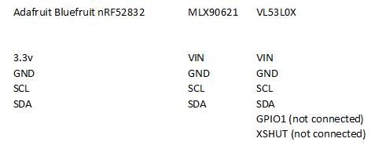

# RejsaRubberTrac
An IR-sensor array + distance sensor with bluetooth BLE transmitter

Intended to track/view/logg tire temperatures on race- or trackday cars. The temperature is measured at sixteen different points over the full tire width.

A distance sensor is also included for tracking/logging suspension movements.

All data is available over bluetooth BLE.

Current code is for Adafruit's Bluefruit nRF52832 board. 

# Parts

 - Temperature IR-arraysensor MLX90621 GY-906LLC-BAB (120 degrees, more narrow existst too)  
Just an example where to find it: https://eckstein-shop.de/GY-906LLC-BAB-IR-Array-Temperature-Sensor-Module 

 - Laser distance sensor VLX53L0X  
Just an example where to find it: https://www.ebay.co.uk/sch/i.html?_nkw=VL53L0X 

 - Processor/Bluetooth board Adafruit BlueFruit nRF52  
Just an example where to find it: https://www.electrokit.com/produkt/adafruit-feather-nrf52-bluefruit-le-nrf52832/ 

The board is powered by a built in rechargable Lipo battery, a USB micro connector or 12 volts.

# Connecting

Four wires in a bus configuration connects the two sensors and the cpu board.

# Work in progress...

The temperature part is rock stable and the Bluetooth Low Energy BLE seems to be running very very nicely. But the distance sensor drops out from the I2C bus sometimes. Some code to get it more stable and/or soft reset it so it restarts properly is missing.

A small enclosure to 3D-print must be designed. This will include a design that protects the sensors and a snap-in holder so the whole enclosure can easily be removed and put back on the car. If printed in nylon/carbon fiber it will be very light and strong to endure the harsh environment in the wheel well.

The two major track loggers for mobile phones www.gps-laptimer.de and www.racechrono.com already have units and have both done initial tests for integrating support for it.

Discussion thread (in Swedish but feel absolutely free to write in english!) https://rejsa.nu/forum/viewtopic.php?t=113976

# Credits

The code for the IR temperature array sensor MLX90621 is 100% untouched from longjos https://github.com/longjos/MLX90621_Arduino_Camera which in turn is an adaption from robinvanemden https://github.com/robinvanemden/MLX90621_Arduino_Processing

# The stuff you need

