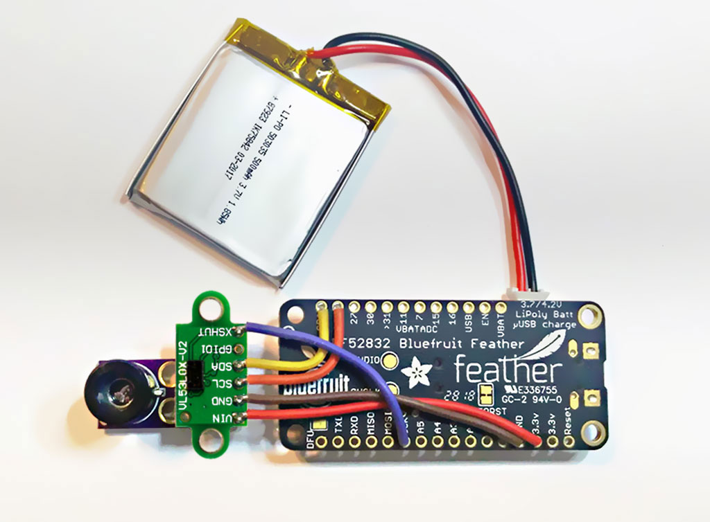
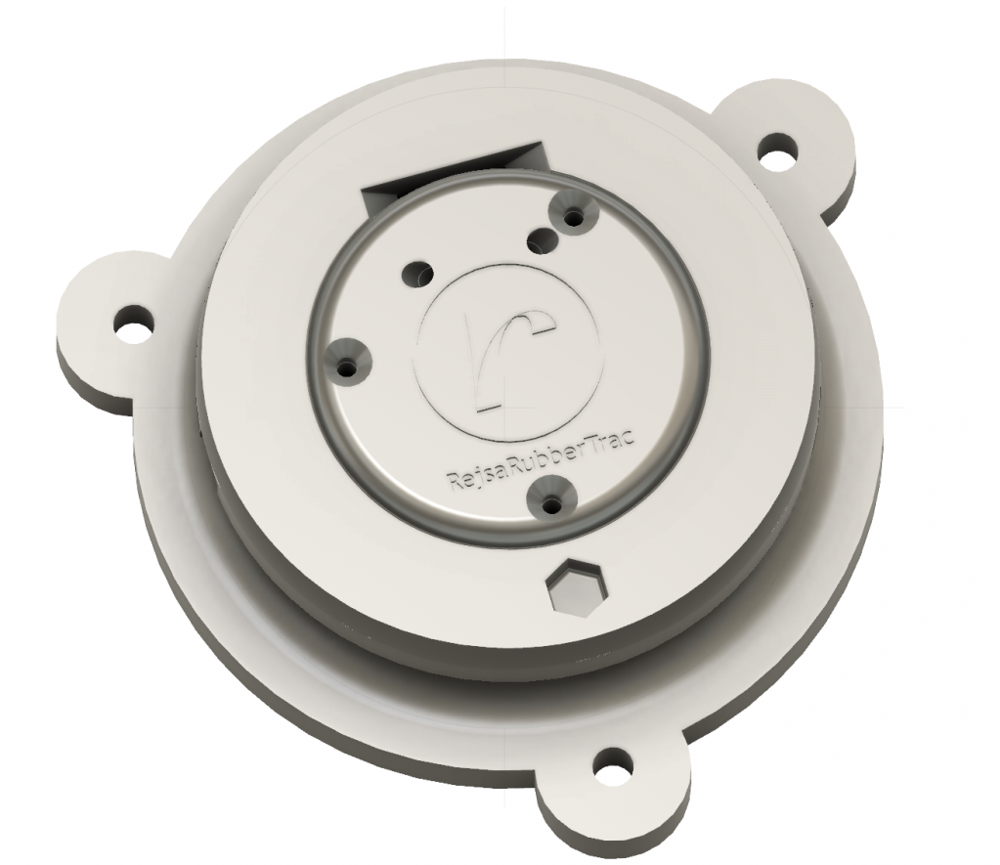

# RejsaRubberTrac - A wireless heat camera for tires  

*__Log and view tire temperature zones on race- and trackday cars__*

For around $100 per wheel you can build your own wireless sensors to log your driving. You'll then easily see if you are overheating the shoulder on one wheel in some particular corner, if one of the rear tires stays a bit too cold or if you need to adjust camber. And many more things about how you attack a course and how your car is set up.

- Temperatures are measured at sixteen different points over each tire's full width.
- All data available in popular Android and iPhone race logging apps via Bluetooth.
- A cheap distance sensor can optionally be added to also log suspension movement.

The two major track loggers for mobile phones <a href=http://www.gps-laptimer.de>__Harry's Laptimer__</a> and <a href=http://www.racechrono.com>__Racechrono__</a> already have test units and are well on their way adding support for RejsaRubberTrac.

UPDATE: Harry's Laptimer v23 with support for RejsaRubberTrac is released!

Watch this short video:  

<a href="http://www.youtube.com/watch?v=Yuy62oPXugs"></a>

Here below Antti at Racechrono is performing stress tests with four RejsaRubberTracs plus a Garmin GLO 10Hz GPS and an OBDLink MX, he reported from these tests with a Google Pixel 2 phone and RaceChrono Pro: *"The ELM327 protocol for OBD-II is quite sensitive for lag/ping time, so it was affected by all the other Bluetooth connections as I expected. The highest update rate for OBDLink MX was still good, but the update rate fluctuates quite a bit, but even at lowest it was still faster than the Bluetooth LE OBD-II reader I tested. The update rate did not fluctuate on that one too much."*


# Easy to build


To build it you need to purchase two small boards (three if you also add distance measuring). Then just connect a few wires between the boards and then finally upload the done and dusted code you find here to the main board using a USB cable. Detailed step by step instructions further below. Then you're up and running! You probably want to get a small enclosure for it though before you mount it to your car!

- __Temperature IR-arraysensor MLX90621 GY-906LLC-BAB__    
(60 degrees field of view ends with BAB, 120 degrees with BAA)  
<a href="https://www.aliexpress.com/w/wholesale-MLX90621.html?SortType=price_asc&SearchText=MLX90621">www.aliexpress.com</a> (~ $47 incl daugther board)  
<a href="https://eckstein-shop.de/GY-906LLC-BAB-IR-Array-Temperature-Sensor-Module">www.eckstein-shop.de</a> (~ 55€ incl daugther board)  
<a href="https://www.mouser.se/ProductDetail/Melexis/MLX90621ESF-BAB-000-SP?qs=sGAEpiMZZMucenltShoSnqRDBUuVzCzKa3Zx6liDTBzqGCq1%252bjAaAA%3d%3d">www.mouser.com</a> (~ 35€ excl daugther board)  
<a href="https://www.digikey.com/product-detail/en/melexis-technologies-nv/MLX90621ESF-BAB-000-TU/MLX90621ESF-BAB-000-TU-ND/4968086">www.digikey.com</a> (~ 36€ excl daugther board)  

- __CPU and Bluetooth board Adafruit BlueFruit nRF52__  
<a href="https://www.mouser.com/ProductDetail/485-3406">www.mouser.com</a> (~ $25)  
<a href="https://www.adafruit.com/product/3406">www.adafruit.com</a> (~ $25)  

- __OPTIONAL: Laser distance sensor VL53L0XV2__  
<a href="https://www.ebay.com/sch/i.html?_nkw=vl53l0xv2&_sop=15">www.ebay.com</a> (~ $5)  
<a href="https://www.aliexpress.com/w/wholesale-vl53l0xv2.html?SortType=price_asc&SearchText=vl53l0xv2">www.aliexpress.com</a> (~ $2.50)  

- __OPTIONAL: Rechargable 3,7V Lipo battery__  
250mAh or larger with JST-PH 2.0mm connector  
Search <a href="https://www.ebay.com/sch/i.html?_nkw=3.7V+lipo+battery+JST-PH+2.0&_sop=15">Ebay</a> or choose <a href="https://www.ebay.com/itm/3-7V-300-mAh-JST-PH-1-0-1-25-1-5-2-0-2-54mm-Rechargeable-Li-po-battery-602030/173757927239">this example</a> (select 2.0mm connector) (~$9)  

# Power supply

The CPU board and the two sensor boards are all powered by connecting power to the CPU board's USB micro connector. The CPU board also has a connector for a Lipo battery - which is automatically charged via the USB connector - so the whole system can run completey wireless with it's own power source for roughly 24 hours with a 500mAh 3,7V Lipo battery. The system can also be run directly from the car's power, not using any Lipo battery, but then a 12 volt to USB 5 volt converter must be added.

# Positioning the sensors

_Click to view a larger version!_  


The wider the tire the further away you need to position the sensor to get the full tire width within the sensors field of view (FOV). There are two versions of the temperature sensor, one with 60 degrees of FOV and one wide version with 120 degrees FOV. The latter can be a better choice if you have very wide tires and need to mount the sensors pretty close. Here below is a table with mounting distances at different tire widths.

__NOTE: You do not have to mount the sensor at exactly the necessary distance!! The distance is simply fine tuned by changing the angle of the sensor, se picture above!__

| Tire width 	| Distance from tire to sensor<br>with 60 degree narrow sensor 	| Distance from tire to sensor<br>with 120 degree wide sensor 	|
|-----------:	|----------------------------------------------------------:	|---------------------------------------------------------:	|
|     135 mm 	|                                                     12 cm 	|                                                     4 cm 	|
|     145 mm 	|                                                     13 cm 	|                                                     4 cm 	|
|     155 mm 	|                                                     13 cm 	|                                                     4 cm 	|
|     165 mm 	|                                                     14 cm 	|                                                     5 cm 	|
|     175 mm 	|                                                     15 cm 	|                                                     5 cm 	|
|     185 mm 	|                                                     16 cm 	|                                                     5 cm 	|
|     195 mm 	|                                                     17 cm 	|                                                     6 cm 	|
|     205 mm 	|                                                     18 cm 	|                                                     6 cm 	|
|     215 mm 	|                                                     19 cm 	|                                                     6 cm 	|
|     225 mm 	|                                                     19 cm 	|                                                     6 cm 	|
|     235 mm 	|                                                     20 cm 	|                                                     7 cm 	|
|     245 mm 	|                                                     21 cm 	|                                                     7 cm 	|
|     255 mm 	|                                                     22 cm 	|                                                     7 cm 	|
|     265 mm 	|                                                     23 cm 	|                                                     8 cm 	|
|     275 mm 	|                                                     24 cm 	|                                                     8 cm 	|
|     285 mm 	|                                                     25 cm 	|                                                     8 cm 	|
|     295 mm 	|                                                     26 cm 	|                                                     9 cm 	|
|     305 mm 	|                                                     26 cm 	|                                                     9 cm 	|
|     315 mm 	|                                                     27 cm 	|                                                     9 cm 	|
|     325 mm 	|                                                     28 cm 	|                                                     9 cm 	|
|     335 mm 	|                                                     29 cm 	|                                                    10 cm 	|
|     345 mm 	|                                                     30 cm 	|                                                    10 cm 	|
|     355 mm 	|                                                     31 cm 	|                                                    10 cm 	|
|     365 mm 	|                                                     32 cm 	|                                                    11 cm 	|
|     375 mm 	|                                                     32 cm 	|                                                    11 cm 	|
|     385 mm 	|                                                     33 cm 	|                                                    11 cm 	|


# Connecting the three boards

Four wires in a bus configuration connects the two sensors and the cpu board.  
One extra fifth wire connects to the distance sensor's XSHUT pin.

| Adafruit Bluefruit nRF52832 	| VL53L0XV2 	| MLX90621 	|
|-----------------------------	|---------	|----------	|
| 3.3V                        	| VIN     	| VIN      	|
| GND                         	| GND     	| GND      	|
| SCL                         	| SCL     	| SCL      	|
| SDA                         	| SDA     	| SDA      	|
| -                           	| GPIO1   	| -        	|
| SCK                         	| XSHUT   	| -        	|


The two sensorboards can easily be connected together electrically and mechanically by "sandwiching" them together with a pin header as in the picture below.


This is the COMPLETE wiring needed. 




# Compiling and uploading the code - Arduino IDE

Easy to do, just follow the <a href=/installArduino.md>complete step by step instruction here</a> to install the IDE and compile and upload the code. 

Here's info on the Adafruit Bluefruit nRF52 board if you're curious and want to dig deeper:  
https://learn.adafruit.com/bluefruit-nrf52-feather-learning-guide

# How often can I get measurements?

Depends. Measuring distance takes time, same with temperatures. And on top of that, with the current library used for Bluetooth communication, depending on how much data you're transmitting some delay is added too. So, __if you don't connect a distance sensor the temperatures are updated faster__. And if the application in the other end limits to subscribe to only eight temperature zones instead of all sixteen it will also all be faster. Compromises...

| Average speed 	| Data                       	|
|---------------	|----------------------------	|
| 6Hz           	| 16 temperatures + distance 	|
| 8Hz           	| 16 temperatures            	|
| 10Hz          	| 8 temperatures + distance  	|
| 16Hz          	| 8 temperatures             	|
| 16Hz          	| distance                   	|

# A main board to mount it all on

Basically you don't need anything more than the five wires connecting the boards together as described above. But if you want to run it from 12 volts from the car's power or if you want a power switch or if you buy the temperature sensor separately without it's daughter board or if you simply don't want cables and want it all pcb mounted or maybe you want jumper pin headers for easy change of the Bluetooth device name for each sensor, <a href="pcb/">there's a board you can use, check  out all info about it here > >

<a href="pcb/">**The PCB page >>**</a>


</a>

# Enclosures

You can of course just create your own casing. Or you can 3D print one of the versions I've put together. There are some different options, either one box for the whole kit including battery. Or a separate smaller enclosure for the sensor components only, easier to place in the wheel well but necessitates a cable between the sensor and cpu/bluetooth units.

All 3D print designs are available for download. If you or a friend have a 3D printer you can print them all yourself, otherwise there are numerous online print shops that will print and ship you the parts pretty cheap. I haven't used them myself but I got recommended www.3dhubs.com as an example.

<a href="3Dprint/">**The 3D print enclosures page >>**</a>

If you design your own case or make an updated variant of any of the 3D print downloads here **please** tell us, pretty sure there will be interest for your version too!

# Bluetooth device name

The default Bluetooth name of each device is "RejsaRubber" __plus__ the last four bytes in the Bluetooth address, __this automatic name will work in most situations__, here's an example of what it can look like:
```
"RejsaRubber6412051B" - for a device with MAC address CC:C9:64:12:05:1B
```
If you want there's an option to include two letters in the name, designating a sensor for Front/Rear and Left/Right. Like FL, RL and so on. 

Default: "RejsaRubber" + four adress bytes  
Optionally: "RejsaRubber" + one of "FL", "FR", "RL", "RR" + three adress bytes      
Optionally for motorbikes: "RejsaRubber" + one of "F" or "R" + one blank space + three adress bytes  

Examples for a device with MAC address CC:C9:64:12:05:1B:
```
"RejsaRubber6412051B" - non positional
"RejsaRubberFL12051B" - Front Left
"RejsaRubberFR12051B" - Front Right
"RejsaRubberRL12051B" - Rear Left
"RejsaRubberRR12051B" - Rear Right
"RejsaRubberF 12051B" - Front (motorbikes)
"RejsaRubberL 12051B" - Rear  (motorbikes)
```

To set a specific device name you connect pins on the main board to ground. Preferably using jumper headers so you can move the jumpers easily to set the prefered name. Lets call the three jumpers CAR, FRONT and LEFT.

| CAR | FRONT | LEFT | Position |                    |
|:---:|:-----:|:----:|:--------:|:------------------:|
|  X  |   X   |   X  |    FL    |     Front Left     |
|  X  |   X   |      |    FR    |     Front Right    |
|  X  |       |   X  |    RL    |      Rear Left     |
|  X  |       |      |    RR    |     Rear Right     |
|     |   X   |   X  |     F    | Front (Motorcycle) |
|     |       |   X  |     R    |  Rear (Motorcycle) |
|     |       |      |    --    | Default auto names |

CAR is the connection marked "A4" on the main board  
FRONT is the connection marked "A5" on the main board  
LEFT is the connection marked "MOSI" on the main board  
Connect them to the pin marked "GND".

# Mirror temperature zones, reverse outside and inside of tire

If you happen to get the tire's outside shoulder temperature showing as the tire's inside temperature in your app you can reverse the out- and inside. By connecting one pin on the main board to ground you reverse the tire's temperature zones. The pin to connect to ground is marked "MISO" on the main board, connect it to the pin marked "GND".

# Testing

To check that your sensor is transmitting you can run this Bluetooth test app. It shows all the temperatures as hex values though so the values are slightly obfuscated. But good for testing that everything is up and running.

https://play.google.com/store/apps/details?id=no.nordicsemi.android.mcp  

With the Arduino IDE (or other serial terminal software) you can view the printed output from the board over USB. Temperatures are shown as degrees in celsius times ten.


# Work in progress...

The software is finished and is stable. But keep an eye out for updates to 3D print enclosures and maybe minor changes.



# Questions and more info

Support forum: www.rejsa.nu/rejsarubbertrac

# Credits

The code for the IR temperature array sensor MLX90621 is 100% untouched from longjos https://github.com/longjos/MLX90621_Arduino_Camera which in turn is an adaption from robinvanemden https://github.com/robinvanemden/MLX90621_Arduino_Processing


