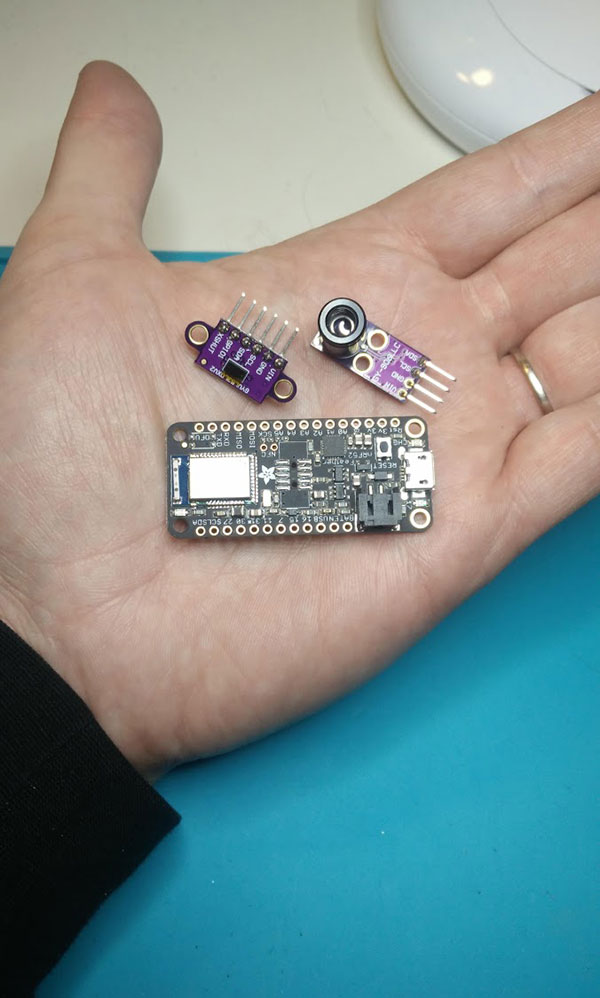
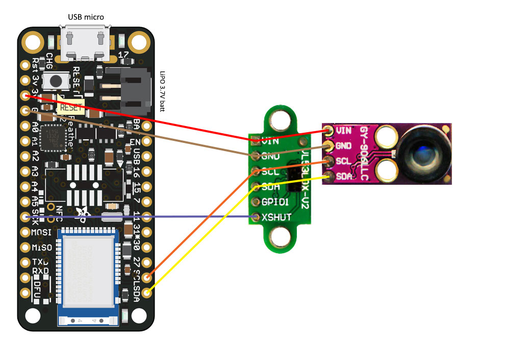
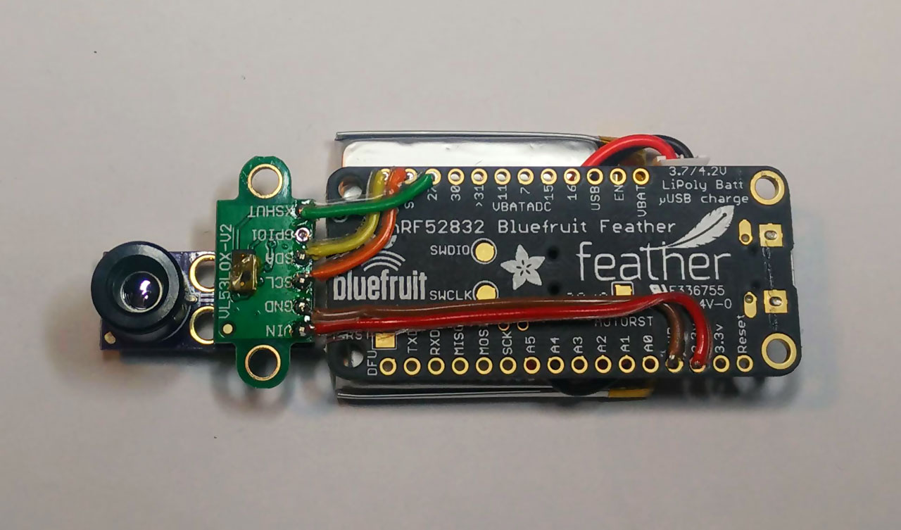
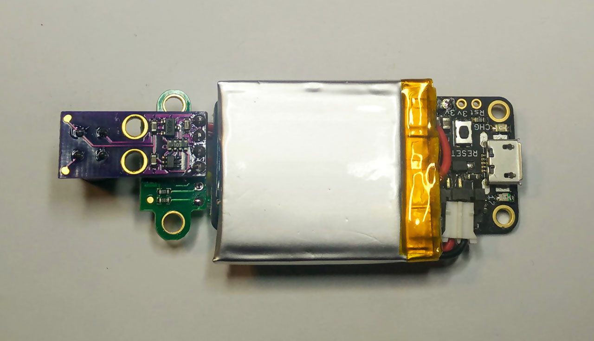
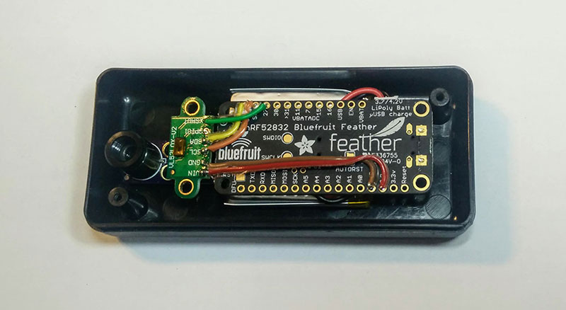
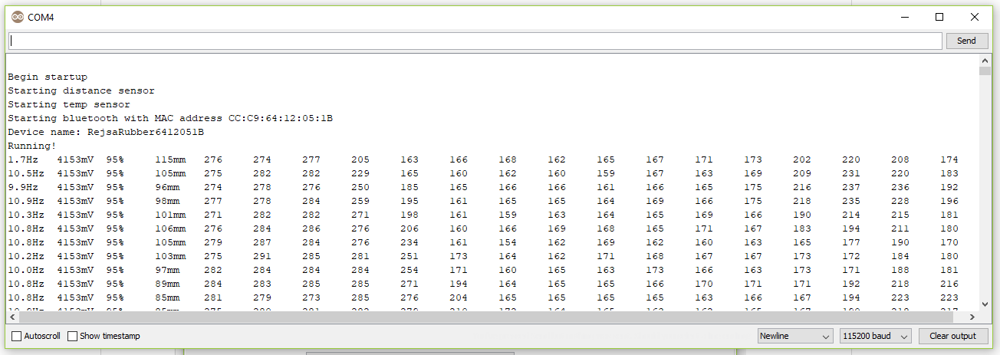

# RejsaRubberTrac  

A cheap wireless tire temperatures and suspension movement logger built from a small cpu/bluetooth board plus a 16-zone temperature sensor and a distance sensor.

*__Intended to track/view/logg tire temperatures on race- and trackday cars.__*

For around 100EUR per wheel you can build your own wireless sensors to log your driving. You'll then easily see if you are overheating the shoulder on one wheel in some particular corner, if one of the rear tires stays a bit too cold or if you need to adjust camber. And many more things about how you attack a course and how your car is set up.

- Temperatures are measured at sixteen different points over each tire's full width.
- Support for a distance sensor is also included for tracking/logging suspension movements.
- All data is available over Bluetooth Low Energy BLE.

The two major track loggers for mobile phones <a href=http://www.gps-laptimer.de>__Harry's Laptimer__</a> and <a href=http://www.racechrono.com>__Racechrono__</a> already have test units and are well on their way adding support for RejsaRubberTrac.

Watch this short video:  

Racechrono are well on their way too, here below performing stress tests with four RejsaRubberTracs plus a Garmin GLO 10Hz GPS and an OBDLink MX. Antti reported these good news from the tests with a Google Pixel 2 phone and RaceChrono Pro: *"The ELM327 protocol for OBD-II is quite sensitive for lag/ping time, so it was affected by all the other Bluetooth connections as I expected. The highest update rate for OBDLink MX was still good, but the update rate fluctuates quite a bit, but even at lowest it was still faster than the Bluetooth LE OBD-II reader I tested. The update rate did not fluctuate on that one too much."*

# Parts

- Temperature IR-arraysensor MLX90621 GY-906LLC-BAB (60 degrees field of view. Ends with BAA for 120 degrees FOV)  
Example of where to find it: https://eckstein-shop.de/GY-906LLC-BAB-IR-Array-Temperature-Sensor-Module 

 - Laser distance sensor VLX53L0X  
Example of where to find it: https://www.ebay.co.uk/sch/i.html?_nkw=VL53L0X&_sop=15  

 - CPU and Bluetooth board Adafruit BlueFruit nRF52  
Example of where to find it: https://www.electrokit.com/produkt/adafruit-feather-nrf52-bluefruit-le-nrf52832/ 

 - Optional: Rechargable 3,7V Lipo battery 250mAh or larger with JST-PH 2.0mm connector  
Example of where to find it: https://www.ebay.co.uk/sch/i.html?_nkw=3.7V+lipo+JST-PH+2.0&_sop=15 

# Power supply

The CPU board and the two sensor boards are all powered by connecting power to the CPU board's USB micro connector. The CPU board also has a connector for a Lipo battery - which is automatically charged via the USB connector - so the whole system can run completey wireless with it's own power source for roughly 24 hours with a 500mAh 3,7V Lipo battery. The system can also be run directly from the car's power, not using any Lipo battery, but then a 12 volt to USB 5 volt converter must be added.

# Positioning the sensors

Click to view a larger version!  

# Connecting the three boards

Four wires in a bus configuration connects the two sensors and the cpu board.  
One extra fifth (optional) wire connects to the distance sensor's XSHUT pin to greatly improve system stability.

| Adafruit Bluefruit nRF52832 	| VL53L0X 	| MLX90621 	|
|-----------------------------	|---------	|----------	|
| 3.3V                        	| VIN     	| VIN      	|
| GND                         	| GND     	| GND      	|
| SCL                         	| SCL     	| SCL      	|
| SDA                         	| SDA     	| SDA      	|
| -                           	| GPIO1   	| -        	|
| 27                          	| XSHUT   	| -        	|

The two sensorboards can easily be connected together electrically and mechanically by "sandwiching" them together with a pin header as in the picture below.

This is the COMPLETE wiring needed. Currently looking at making a small pcb as an interconnect for all connections. Soldered wires are not optimal in this tough environment. The main board will probably be turned over to get its reset button aiming to the enclosure's front. 

Just an enclosure for initial testing:

# Bluetooth device name

The default Bluetooth name of each device is "RejsaRubber" __plus__ the last four bytes in the semi unique bluetooth MAC address, like this:  
- RejsaRubber6412051B - for a device with MAC address CC:C9:64:12:05:1B

At compile time there is alternatively a choice of manually setting a device to one of four fixed names:  
- RejsaRubberFrontL 
- RejsaRubberFrontR 
- RejsaRubberRearL
- RejsaRubberRearR

# Compiling and uploading the code - Arduino IDE

Read the <a href=/installArduino.md>complete step by step instruction here</a> to install the IDE and compile and upload the code. 

Here's info on the Adafruit Bluefruit nRF52 board:  
https://learn.adafruit.com/bluefruit-nrf52-feather-learning-guide

# Testing Bluetooth BLE

Here below are links to two Android Bluetooth BLE apps that can connect and show the live data that is transmitted. They show hex values only though so the sensor values are slightly obfuscated. But good for testing that everything is up and running.

https://play.google.com/store/apps/details?id=no.nordicsemi.android.mcp  
https://play.google.com/store/apps/details?id=com.punchthrough.lightblueexplorer

# Testing over USB

With the Arduino IDE (or other serial terminal software) you can view the printed output from the board over USB. Temperatures are shown as degrees in celsius times ten.

# Work in progress...

The temperature part is rock stable and Bluetooth BLE seems to be running very nicely. But the distance sensor can at rare occasions hang, maybe a watchdog function needs to be added?

A small enclosure to 3D-print must be designed. This will include a design that protects the sensors and a snap-in holder so the whole enclosure can easily be removed and put back on the car. If printed in nylon/carbon fiber it will be very light and strong to endure the harsh environment in the wheel well.

A small IR-transparent sensor protection window is on it's way to be sourced too.

# Questions and more info

Support forum: www.rejsa.nu/rejsarubbertrac

# Credits

The code for the IR temperature array sensor MLX90621 is 100% untouched from longjos https://github.com/longjos/MLX90621_Arduino_Camera which in turn is an adaption from robinvanemden https://github.com/robinvanemden/MLX90621_Arduino_Processing

