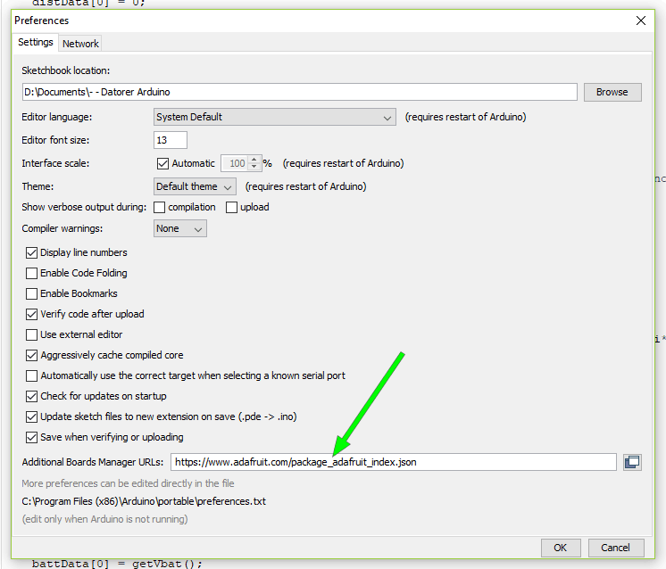
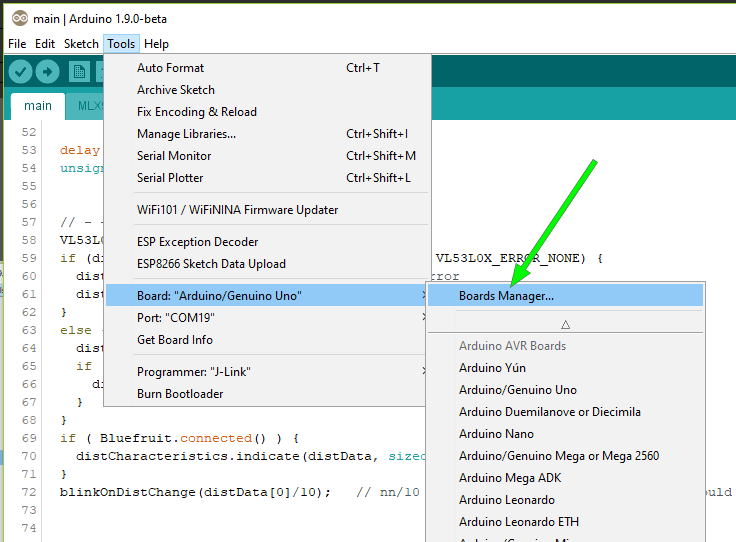
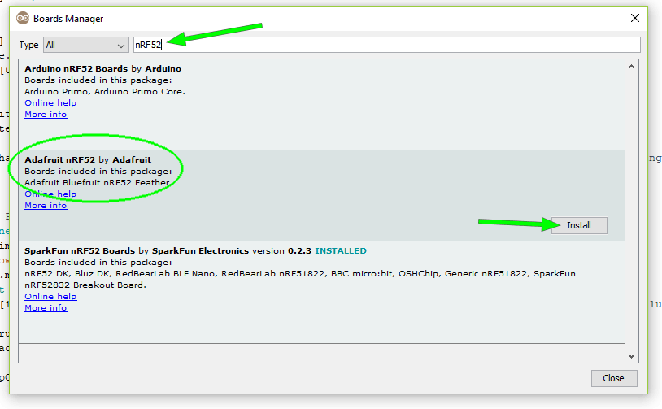
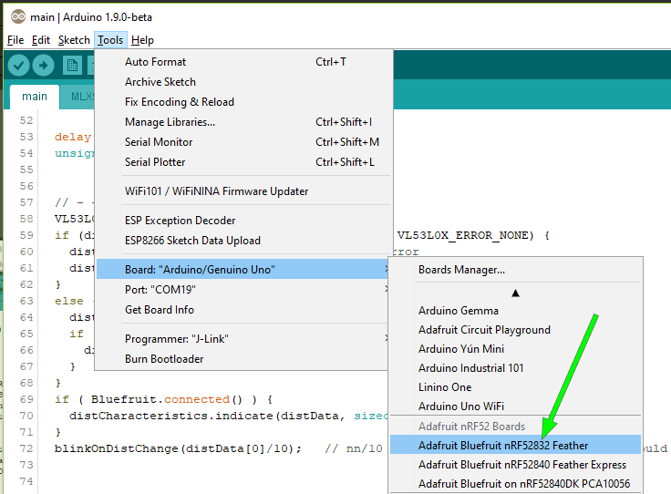
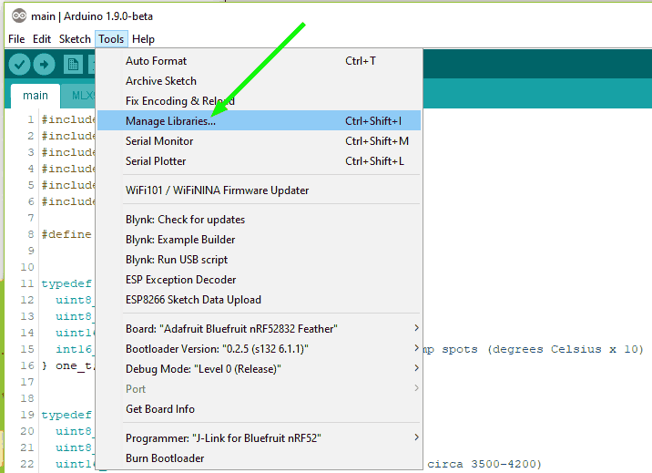
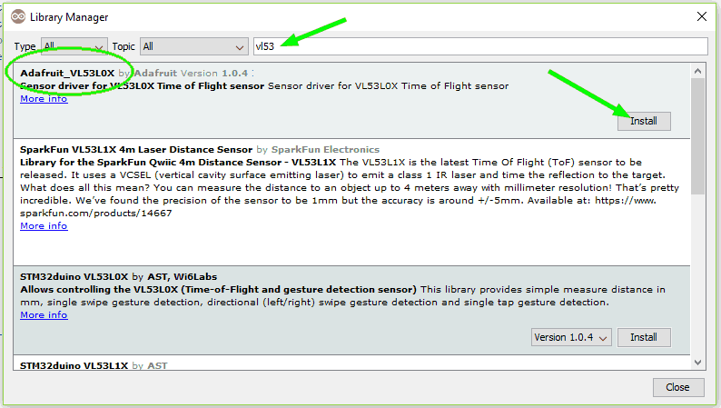
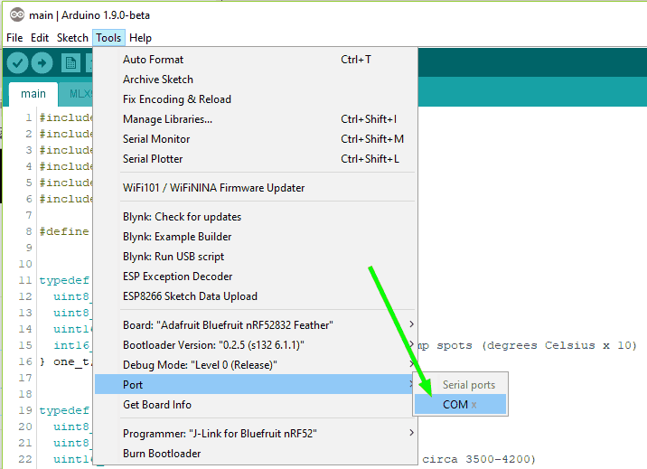

# Install Arduino IDE to compile and upload the code

- Download the released version of Arduino IDE __and__ the beta build (not the hourly)
https://www.arduino.cc/en/Main/Software

- Install the released version

- Unzip the beta build on top of your newly installed folder, replacing the just installed files with the newer ones from the zip

- Start Arduino IDE, choose "File" > "Preferences" and copy this line below into the "Additional Boards Manager URLs" field

  https://www.adafruit.com/package_adafruit_index.json

- Go to "Boards Manager"

- Enter "nRF52" in the search box and then install "Adafruit nRF52 Boards". This will take a while to complete...

- Choose "Adafruit Bluefruit nRF52832 Feather"

- Go to "Manage Libraries"

- Enter "vl53" in the search box and then install "Adafruit_VL53L0X"

- Connect the Adafruit Bluefruit board to your computer's USB and choose the corresponding COM port

- Place all the files downloaded from here https://github.com/MagnusThome/RejsaRubberTrac/tree/master/main in a directory called "main"

- Open the main.ino file and choose "Upload"

- If you get error messages when trying to upload first check that you've chosen the correct COM port number and that the board is connected properly.  

- If you get error messages looking something like this below (and you are sure you are using the correct COM port) you need to update the bootloader to a newer version, follow the guide on the link below.  
`File "nordicsemi\dfu\dfu_transport_serial.py", line 243, in send_packet`  
`File "nordicsemi\dfu\dfu_transport_serial.py", line 282, in get_ack_nr`  
`nordicsemi.exceptions.NordicSemiException: No data received on serial port. Not able to proceed.`  
https://learn.adafruit.com/bluefruit-nrf52-feather-learning-guide/updating-the-bootloader

- When done you can open the "Serial Monitor" under the "Tools" menu and view the Arduino board's status and data transmitted. Temperatures are in degrees celsius times ten.

- Have fun!
