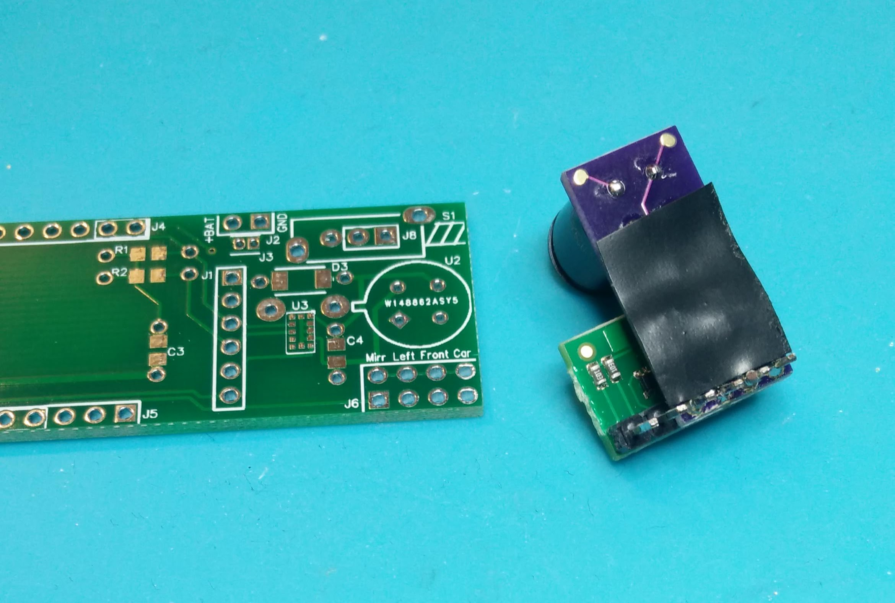
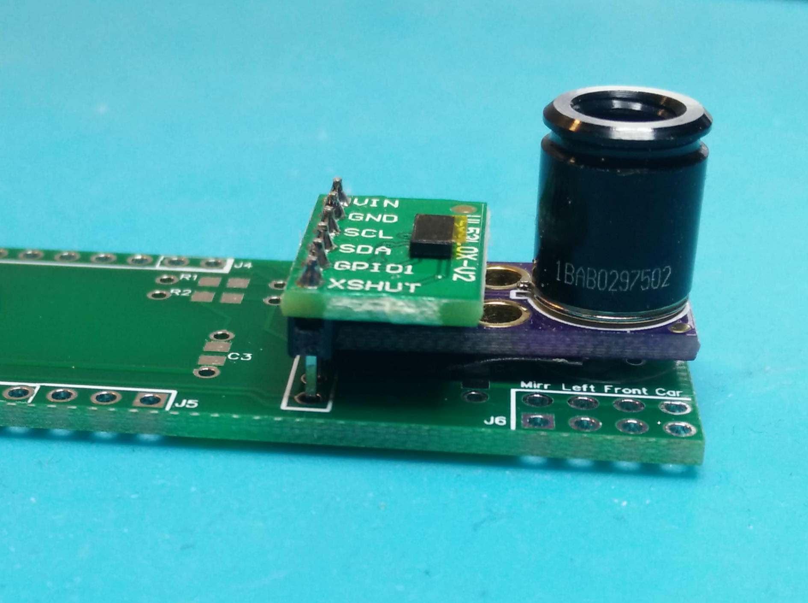
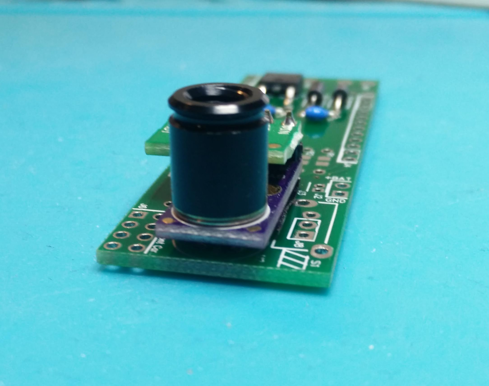
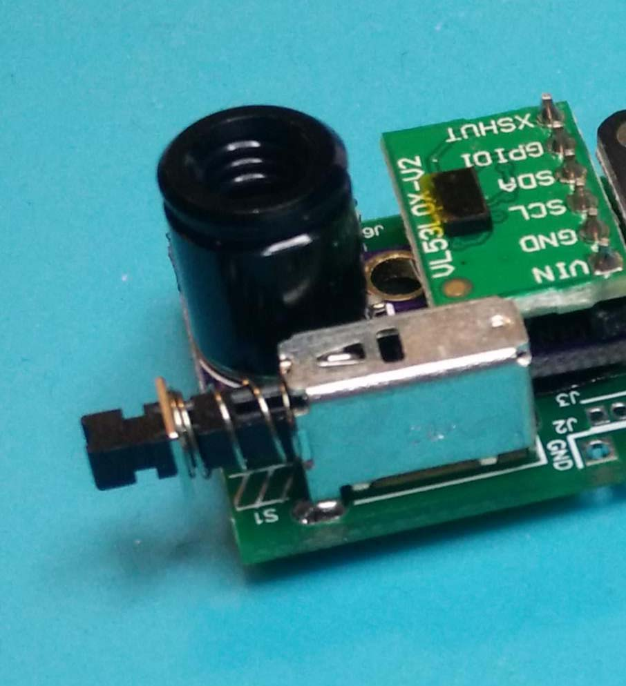
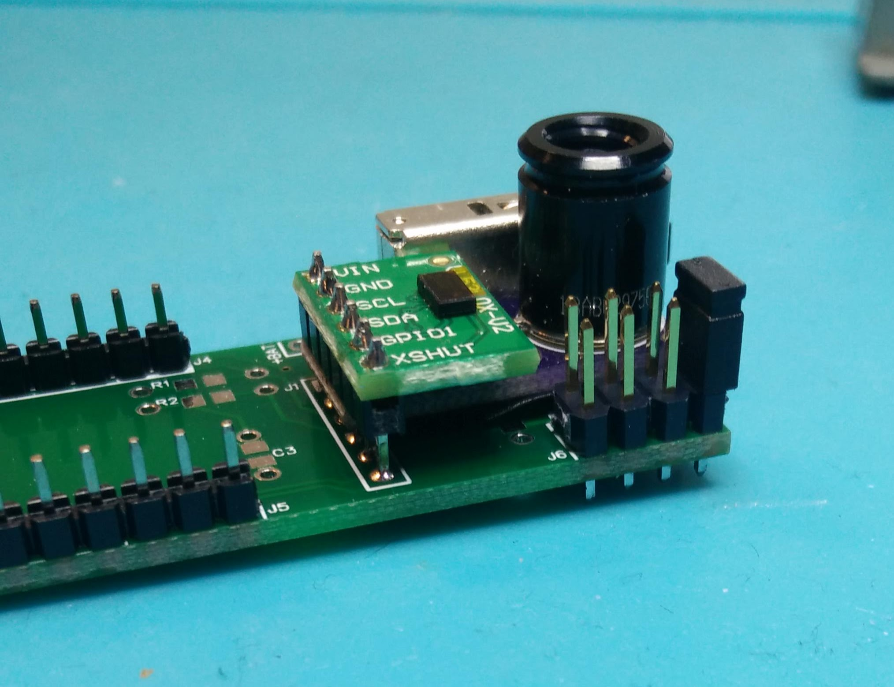
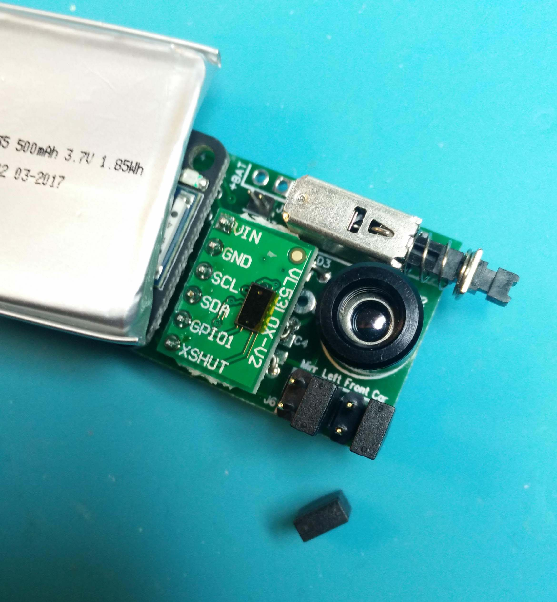
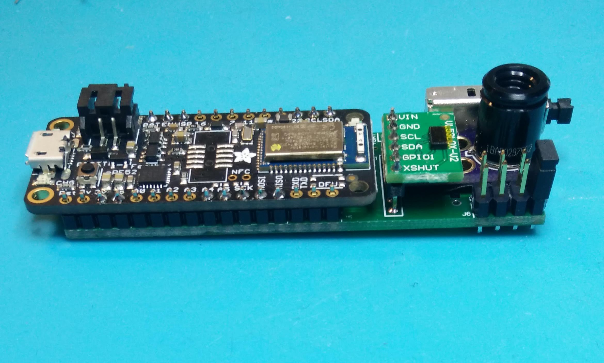
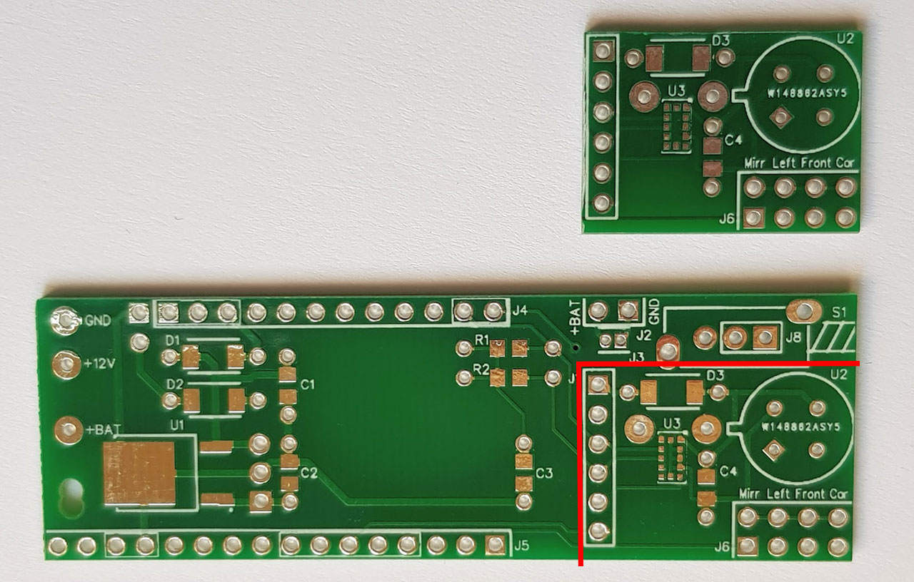
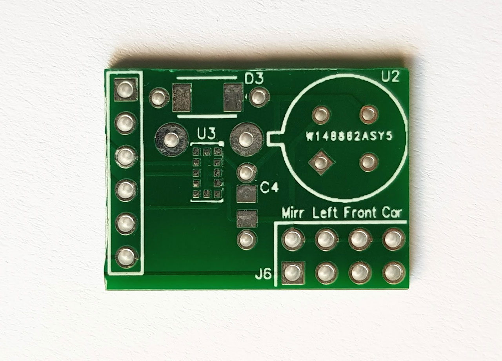

# Interconnect carrier board to mount everything on

This extra board is not needed at all to build the sensor kit! The minimum way of putting the kit together is just the five wires between the boards, as you can see on the main page, and nothing else!  

But this board is handy if you want to run the kit from the car's 12V. Or if you want to use jumpers to set a position ID in the sensor name. Or to add a power switch. Or if you buy the temperature sensor without it's daughter board. Here you have a main board to mount it all on.

A list of all components needed with links to mouser can be found in an Excel sheet here:
https://github.com/MagnusThome/RejsaRubberTrac/edit/master/pcb

# More info coming...

But for now:

# Running from 12 volts

Here's how to mount the components neccesary for running everything from 12V. Check the excel file component list above on what components to get!

# Mounting sensors with daughter boards

Mount the two sensor boards togther with a six pin header. 

Cut of the "ears" of the distance sensor board with a pair of pliers.  

Put insulation on the bottom so the components can't touch the main board:  

It's a little fiddly to get it all soldered on perfectly straight. I suggest you solder only one pin first. Then try to get it straight. When perfect solder the rest of the pins.  

Getting it straight...  

You don't have to remove the dark yellow protection film from the distance sensor. You can measure distances with the protection film still on the sensor, the only downside is that it will display random results when there are no objects to measure in front of the sensor. 

# Power switch 

Note: if you don't mount a switch everything will by default be switched on. No need for any jumpers to turn the board on.  

# Jumper pin headers

Mount the 4x2 pin headers for the jumpers which set wheel position (left front, right rear...) and mirror outside/inside edge of the tire.  

The jumpers are marked so you know which one sets what:  

# Pin headers to cpu/bluetooth board

Mount the two long pin headers connecting to the cpu/bluetooth board. Note: you don't have to solder all pins if you don't want, there are markings on the board showing what pins you have to solder.

Solder on the cpu/bluetooth board. Again, not all pins needs to be soldered but if you're unsure, solder all.

NOTE: Make sure you place the shorter of the two pin headers in its proper holes. There is an adjacent extra hole for another (normally unused) component that can be mistaken to belong to the header. There are clear markings on the board to tell you which is which.

# Mounting a temperature sensor that comes __without__ a daughter board

As you can see in the component list you can either order the temperature sensor mounted on a daughter board or order it separately as a component without the daughter board. It is usually sold on a daughter board from China. If you get the version without a daughter board there are two extra components you need to solder on to the board. They are of course listed in the component list excel sheet.

In addition to this you need to mount the temperature sensor 3,5mm above the board if you want to use any of the 3D printed cases for this board. This is to make sure the 60 degree of field of view isn't hindered by the limited size window on the case. Also make sure you turn the sensor so the right pins are inserted in the correct respective mounting holes. There is a marking on the board showing a circle with a protrusion that should match a small tab sticking out on the sensor.

To help mounting the sensor as a separate component without a daugther board at the right height and also completely straight there is a small 3D printable cylinder that you can put between the sensor and the board:   

<a href="../3Dprint/printables/Temperature%20Sensor%20Mounting%20Spacer%203%2C5mm.stl">Spacer for the 60 degree temperature sensor</a>  
<a href="../3Dprint/printables/Temperature%20Sensor%20Mounting%20Spacer%2010mm.stl">Spacer for the 120 degree wide temperature sensor</a>  

If you don't have access to printing this spacer the best way is to first only solder one leg of the sensor. Check the height and then adjust it straight. Then solder the remaining legs.  

# Here's info on how to order the pcb

You can download the gerber files here and get boards done anywhere you want. Or you can order them here too, this is where I got my made. I think I might get a small kickback if you order here but again, get them done wherever you want :-) !

https://www.pcbway.com/project/shareproject/RejsaRubberTrac_____v1_1.html

# Make a temperature sensor daughter board

If you buy the temperature sensor separate, without it's daughter board, you can cut down a mainboard to create the missing daughter board. Cut very carefully exactly as in the pictures below.  

Don't forget to mount C4 (1uF) and D3 (1N4007). For a photo on how to mount them check the picture further up on this page.

If you use very long cables between the cpu board and this daughter board and have problems getting readings you might need to mount two pull up resistors on the I2C bus on the daughter board. But this would probably only be needed in extreme cases.

  

# Again, more info coming but this is a start
