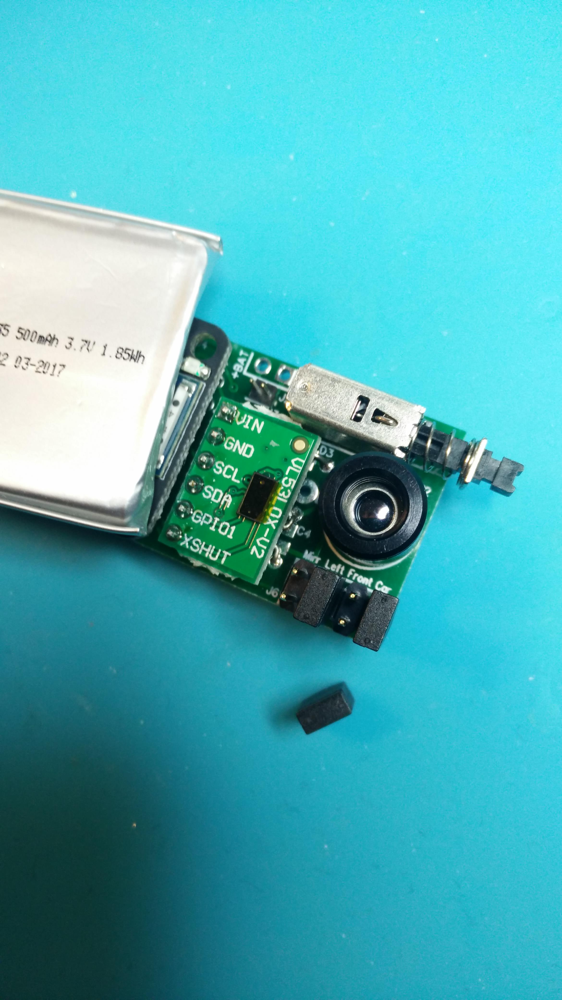

# Board to mount everything on

This is handy if you want to run the kit from the car's 12V. Or if you want to use jumpers to set each sensors wheel position. Or to add a power switch. Or if you buy the temperature sensor without it's daughter board, here you have a main board to mount it all on.

A list of all components needed with links to mouser:

<a href="https://github.com/MagnusThome/RejsaRubberTrac/blob/master/pcb/Component%20list%20RejsaRubberTrac%20board%20v1.1%20(2019-02-21).xlsx">Excel file: Component list RejsaRubberTrac board v1.1 (2019-02-21).xlsx</a>

# More info coming...

But for now:

# Running from 12 volts

Here's how to mount the components neccesary for running everything from 12V. Check the excel file component list above on what components to get!

# Sensors on daughter boards

Mount the two sensor boards togther with a six pin header.

Put insulation on the bottom so the components there can't touch the main board.

It's a little fiddly to get it all soldered on perfectly straight. I suggest you solder only one pin first. Then try to get it straight. When perfect solder the rst of the pins.

Yeah, straight.

Mount the power switch. 

Note: if you don't mount a switch everything will by default be switched on. No need for any jumpers to turn the board on.

Now mount the 4x2 pin headers for the jumpers which set wheel position (left front, right rear...) and mirror outside/inside edge of the tire.

Also mount the two long pin headers for the cpu/bluetooth board (in the left of the picture). Note: you don't have to solder all pins if you don't want, there are markings on the board showing what pins you have to solder.

Solder on the cpu/bluetooth board. Again, not all pins needs to be soldered but if you're unsure, solder all.

# Jumpers

The jumpers are marked so you know which one sets what:

# Here's info on how to order the pcb

You can download the gerber files here and get boards done anywhere you want. Or you can order them here too, this is where I got my made. I think I might get a small kickback if you order here but again, getthem done wherever you want :-) !

https://www.pcbway.com/project/shareproject/RejsaRubberTrac_____v1_1.html

# Again, more info coming but this is a start
